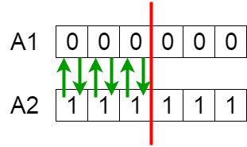

遗传算法矩阵实验室
=========

`遗传算法(genetic algorithm)`是受Charles Darwin自然进化理论启发的搜索启发式算法。该算法反映了自然选择的过程，选择最合适的个体进行繁殖，以产生下一代后代。


## Notion of Natural Selection

自然选择的过程，开始于种群中最适个体的选择。它们产生子代，子代继承父代的特性。如果父代有最适值，子代将有比父代更好机会生存。该选择过程将迭代进行，直到最适值种群个体出现。

分析该问题，可以从DDD方面描述，从种群进化和优胜劣汰方面，我们需要专业术语进行描述。我们考虑遗传进化是多个解决方案对一个抽象问题的描述。

遗传算法考虑5个阶段

1. 初始化种群(population)
2. 适值函数(fitness)
3. 蒙特卡罗选举(selection)
4. 交叉(crossover)
5. 变异(mutate)

## Initial Population

一个个体(Individual)是一系列**基因** 的集合，基因组成染色体(`Chromosome`)的解决方案。

在遗传算法中，一系列基因用字符(char)表示，术语称为`alphabet`，字母表或基因池。通常用二进制表示(1或0)。如下看到的染色体基因编码：


## Fitness Function

适值函数决定了一个个体的适应能力(一个个体与其它个体的竞争能力)。每个个体都拥有自身的`适值分数(fitness score)`。个体被选中作为繁衍基于它自身的`适值分数`。

## Selection

选择阶段就是选择最适个体，并将它们的基因传递给下一代。

根据它们的适值分数(fitness score)选择一对个体(父代)。适值数高的，将有更高的机会被选择进行繁衍。

## Crossover

交叉在遗传算法中是最有成效的阶段。对于每一对被匹配到的父代，交叉点(crossover point)在基因中被随机选取。

例如，从第3个位置开始：


子代的创建，来源于父代基因的交换



新生子代被添加到种群中。子代的产生，都是按照批次出现，不会出现年龄的概念，也不考虑种群数量增多的情况。

## Mutation

在某些新生代中，它们某些基因可能以一种非常低的概率发生`变异(mutation)`。这意味着新生代的基因可能会出现`反转(flipped)`。


基因突变是为了保持种群内的多样性和防止过早收敛。一般有两种情况考虑基因突变的情况：

1. 当种群进化到一定阶段出现无解(种群所有个体基因全部相同，交叉后子代基因和父代基因没有变化；但是所有个体都不满足条件，种群无法再次进化)
2. 过早收敛，得不到一个最优解。特别是多个维度中，收敛出现偏向某一个维度。


## Termination

终止条件是种群收敛(新生子代和前一代没有明显不同)。这表示遗传算法得出的解已经满足我们的问题。

## Psuedocode

```
START
Generate the initial population
Compute fitness
REPEAT
    Selection
    Crossover
    Mutation
    Compute fitness
UNTIL population has converged
STOP
```

## 遗传算法实现的排课系统

排课系统的实现原理是：

- 将Group(班级人数)+Class(教室容量)+Teacher(教师)+Lesson(课程)+Time(每节时间)重组成为基因编码。
- 在每次的种群进化中，获取进化的染色体`IChromosome`，该染色体是每次迭代产生的。解组该染色体，得到排课的基因编码`[Group][Class][Teacher][Lesson][Time]`
- 对解组的基因编码进行阈值处理，每次获得适值函数fitness。
- 适值函数fitness在每次迭代中重新计算，直到满足阈值，终止；不能满足阈值，达到种群最大进化数，终止。


适值函数不是每次都能达到阈值，它获得的是一个最优解。